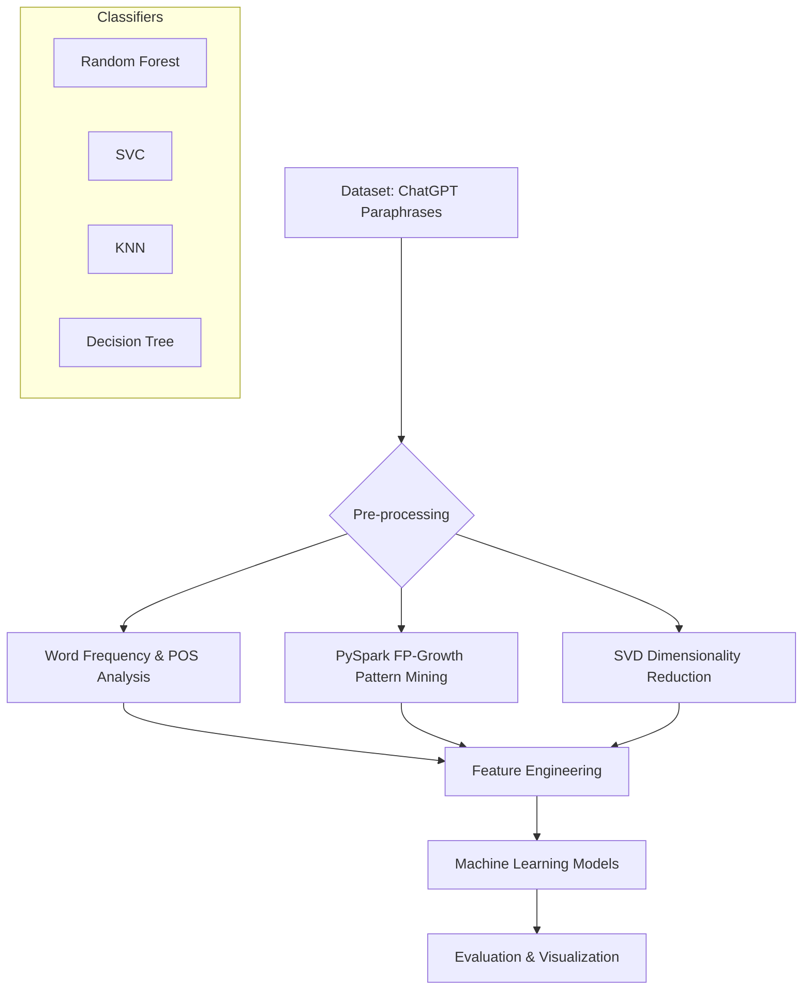

# 🤖 ChatGPT vs. 🧠 Human: Text Pattern Analysis & Detection

[](https://www.python.org/downloads/)
[](https://spark.apache.org/)
[](https://opensource.org/licenses/MIT)

This project provides a comprehensive comparative analysis between human-written content and ChatGPT-generated paraphrases. By leveraging large-scale data mining techniques and machine learning, we identify distinctive linguistic patterns that distinguish AI-generated text from human expression.

---

## 🔍 Project Overview

As Large Language Models (LLMs) become more sophisticated, the boundary between human and AI writing blurs. This repository implements a multi-faceted analytical approach to explore these differences:

1.  **Linguistic Distribution**: Comparative analysis of word frequencies and Part-of-Speech (POS) tags.
2.  **Semantic Structure**: Utilizing **SVD (Singular Value Decomposition)** to understand latent structural differences.
3.  **Frequent Pattern Mining**: Using **PySpark's FP-Growth** algorithm to identify unique word association rules.
4.  **AI Detection**: Building robust machine learning classifiers to distinguish between original and AI-paraphrased text.

## 🛠️ Technology Stack

| Category | Tools & Libraries |
| :--- | :--- |
| **Core Language** | Python 3.8+ |
| **Big Data Processing** | PySpark (Spark SQL, Spark MLlib) |
| **NLP** | NLTK, Scikit-learn (TfidfVectorizer) |
| **Data Analysis** | Pandas, NumPy |
| **Machine Learning** | Scikit-learn (Random Forest, SVC, KNN, Decision Tree) |
| **Visualization** | Matplotlib, Seaborn |

## 🏗️ Project Architecture



## 📁 Repository Structure

```text
├── codes/                        # Core exploratory analysis notebooks
│   ├── Word_frequency.ipynb      # Frequency & POS distribution analysis
│   ├── Paraphrase_Pattern_GPT.ipynb # FP-Growth mining on AI text
│   ├── Paraphrase_Pattern_Human.ipynb # FP-Growth mining on Human text
│   └── Paraphrase_SVD.ipynb      # Latent semantic analysis (SVD)
├── text_pattern_analysis/        # Modularized Python package
│   ├── analysis/                 # Analysis logic (Pattern mining, SVD)
│   ├── models/                   # Classifier implementations
│   ├── utils/                    # Data loaders & text processors
│   └── visualization/            # Plotting utilities
├── dataming_result/              # Exported CSV results & association rules
├── Machine_Learning.ipynb        # Final model training and evaluation
├── run_analysis.py               # Automated execution script
├── fix_typos.py                  # Notebook maintenance utility
└── SCRIPTS.md                    # Detailed script usage documentation
```

## 🚀 Getting Started

### 1. Installation

Clone the repository and install the required dependencies:

```bash
git clone https://github.com/pileuszu/study-text-analysis-ai-vs-human.git
cd study-text-analysis-ai-vs-human
pip install -r requirements.txt
```

*Note: Ensure you have a Java Runtime Environment (JRE) installed for PySpark functionality.*

### 2. Dataset Setup

The project uses the **"ChatGPT Paraphrases"** dataset from Kaggle.
1. Download the dataset from [Kaggle](https://www.kaggle.com/datasets/vaneet/chatgpt-paraphrases).
2. Place the `chatgpt_paraphrases.csv` file in the project root.

### 3. Running the Analysis

You can run the entire pipeline automatically:

```bash
python run_analysis.py
```

Or explore individual components through the Jupyter notebooks in the `codes/` directory.

## 📊 Key Findings & Results

*   **Linguistic Variance**: Human texts tend to exhibit higher lexical diversity and specific POS patterns compared to AI-generated paraphrases.
*   **Pattern Association**: AI models often follow more "predictable" word sequences, which are captured through association rules (Confidence > 0.5).
*   **Detection Performance**:
    *   **Random Forest Classifier**: Achieved the most stable performance with cross-validation.
    *   **SVC (Support Vector Classification)**: Strong performance in high-dimensional TF-IDF space.
    *   **Average Accuracy**: ~76% on balanced detection tasks.

## 👥 Contributors

Developed by **Team 13** as part of the Data Mining research course.

## 📄 License

This project is licensed under the MIT License - see the [LICENSE](LICENSE) file for details.
